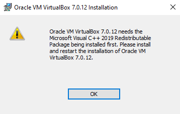
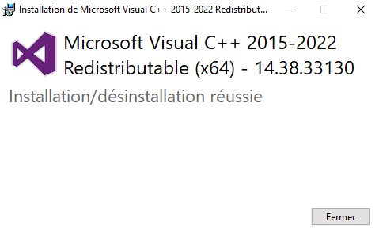

# TP
Pour pouvoir lancer ce TP en local, il va falloir suivre les instructions suivantes:

  * Installer virtualBox

1) Téléchargez le fichier d’installation sur le site officiel de [VirtualBox](https://www.virtualbox.org/wiki/Downloads)

2) Exécutez-le

Il vous sera peut-être demandé d’installer des pilotes, car VirtualBox va créer une ou plusieurs cartes réseaux virtuelles

<center></center>
Lien: https://learn.microsoft.com/en-us/cpp/windows/latest-supported-vc-redist?view=msvc-170
<center></center>

5) Suivez la procédure en laissant les paramètres par défaut.

  * Télécharger l'image [ISO Ubuntu](https://www.linuxvmimages.com/images/ubuntu-2004/#ubuntu-20044)

## **Sur la VM Linux:**
  * Installer [IntelliJ IDEA](https://www.jetbrains.com/help/idea/installation-guide.html#standalone) et lancer la commande suivante:
```Bash
  ln -s /opt/idea-x/bin/idea.sh /usr/local/bin/idea
```
  * Installer et configurer [Docker](https://docs.docker.com/engine/install/ubuntu/#install-using-the-repository)
```Bash
  # Add Docker's official GPG key:
  sudo apt-get update
  sudo apt-get install ca-certificates curl gnupg
  sudo install -m 0755 -d /etc/apt/keyrings
  curl -fsSL https://download.docker.com/linux/ubuntu/gpg | sudo gpg --dearmor -o /etc/apt/keyrings/docker.gpg
  sudo chmod a+r /etc/apt/keyrings/docker.gpg
    
  # Add the repository to Apt sources:
  echo \
    "deb [arch=$(dpkg --print-architecture) signed-by=/etc/apt/keyrings/docker.gpg] https://download.docker.com/linux/ubuntu \
    $(. /etc/os-release && echo "$VERSION_CODENAME") stable" | \
    sudo tee /etc/apt/sources.list.d/docker.list > /dev/null
  sudo apt-get update
  
  sudo apt-get install docker-ce docker-ce-cli containerd.io docker-buildx-plugin docker-compose-plugin
```
  * installer et configurer [Git](https://git-scm.com/book/fr/v2/D%C3%A9marrage-rapide-Installation-de-Git)
```Bash
  sudo apt-get install git
  git config --global user.name "Nom Prénom"
  git config --global user.email ""
```
* installer [java8](https://www.oracle.com/java/technologies/downloads/#java8)
```Bash
  sudo apt-get update
  sudo apt install java-package
  make-jpkg jdk-8u391-linux-x64.tar.gz
  sudo dpkg -i oracle-java8-jdk_8u391_amd64.deb
  sudo update-alternatives --config java
  java -version

  sudo nano /etc/environment et collez la ligne suivante à la fin du fichier: JAVA_HOME="/usr/lib/jvm/oracle-java8-jdk-amd64/jre/bin/java"
  source /etc/environment
```
* installer Maven:
```Bash
  sudo apt-get install maven
```